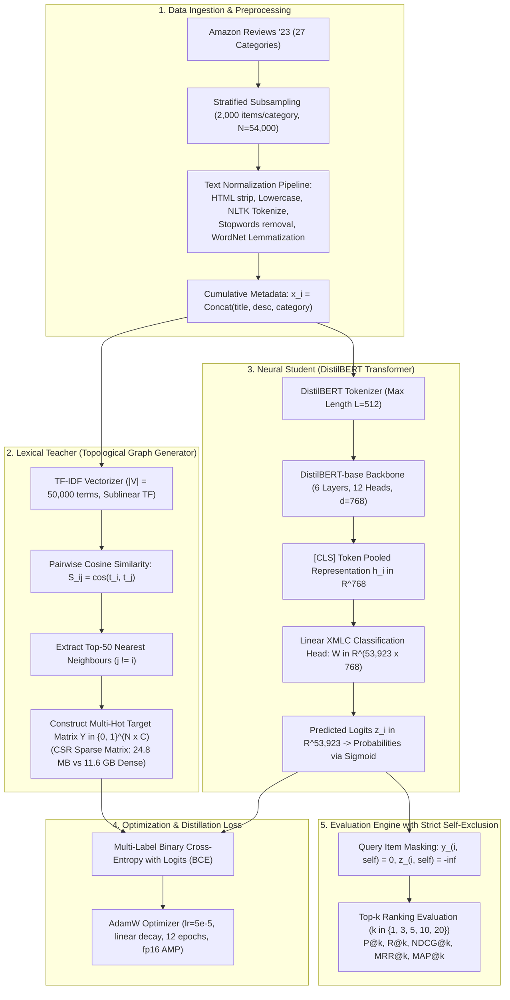
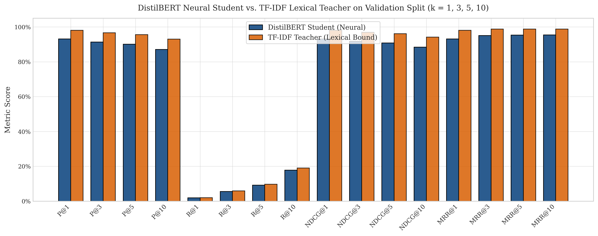
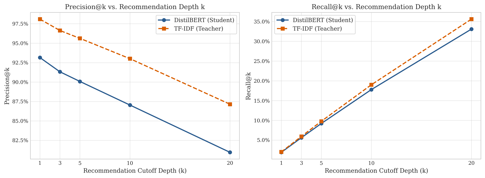

# Distilling Lexical Product Associations into Deep Transformers: An Extreme Multi-Label Approach for Natural Language E-Commerce Search

[](https://www.python.org/)
[](https://pytorch.org/)
[](https://huggingface.co/docs/transformers/index)
[](arxiv_submission/main.tex)
[-76b900.svg)](https://www.nvidia.com/en-us/data-center/tesla-t4/)
[](LICENSE)

> **Authors:**  
> **Sunnidhya Roy\*** ([rsunnidhya@gmail.com](mailto:rsunnidhya@gmail.com)) &bull; **Samarpita Bhaumik\*** ([samarpitabhaumik2017@gmail.com](mailto:samarpitabhaumik2017@gmail.com))  
> *\*Equal contribution. Department of Data Science and Artificial Intelligence, International Institute of Information Technology Bangalore (IIIT Bangalore)*

---

## Table of Contents

- [Overview & Research Abstract](#overview--research-abstract)
- [Key Scientific Contributions](#key-scientific-contributions)
- [Methodology & Theoretical Framework](#methodology--theoretical-framework)
  - [Problem Formulation](#problem-formulation)
  - [Lexical Teacher & Pseudo-Label Distillation](#lexical-teacher--pseudo-label-distillation)
  - [DistilBERT Neural Student Architecture](#distilbert-neural-student-architecture)
  - [Strict Self-Exclusion Protocol](#strict-self-exclusion-protocol)
  - [Resolution of the Baseline Alignment Bug](#resolution-of-the-baseline-alignment-bug)
  - [Memory Optimization: Compressed Sparse Rows (CSR)](#memory-optimization-compressed-sparse-rows-csr)
- [Empirical Evaluation & Results](#empirical-evaluation--results)
  - [Quantitative Information Retrieval Ranking Benchmark](#quantitative-information-retrieval-ranking-benchmark)
  - [Multi-Label Classification Performance](#multi-label-classification-performance)
  - [Training Dynamics across 12 Epochs](#training-dynamics-across-12-epochs)
- [Qualitative Natural Language Generalization Benchmark](#qualitative-natural-language-generalization-benchmark)
- [Architectural Scalability & Production Roadmap](#architectural-scalability--production-roadmap)
  - [The XMLC Catalog Scalability Bottleneck](#the-xmlc-catalog-scalability-bottleneck)
  - [Transition to Dual-Encoder (Two-Tower) Vector Search](#transition-to-dual-encoder-two-tower-vector-search)
- [Repository Structure](#repository-structure)
- [Reproduction & Execution Guide](#reproduction--execution-guide)
  - [Prerequisites & Environment Setup](#prerequisites--environment-setup)
  - [Executing the Final Experimental Notebook (`rs-final-arxiv.ipynb`)](#executing-the-final-experimental-notebook-rs-final-arxivipynb)
  - [Compiling the LaTeX Manuscript (`arxiv_submission/`)](#compiling-the-latex-manuscript-arxiv_submission)
- [Computational Budget & Hardware Environment](#computational-budget--hardware-environment)
- [Citation](#citation)
- [License](#license)

---

## Overview & Research Abstract

Traditional e-commerce search platforms rely heavily on inverted indices and token-level lexical matching algorithms (e.g., **BM25** and **TF-IDF**), which frequently fail when faced with conversational, intent-driven, or paraphrased user queries—the classic **vocabulary mismatch problem**. 

In this work, we formulate conversational product recommendation as an **Extreme Multi-Label Classification (XMLC)** problem over an e-commerce catalog of $N = 54{,}000$ products spanning 27 balanced retail categories from the ***Amazon Reviews '23*** benchmark. Using a pre-trained **DistilBERT** transformer encoder, we distill dense item-to-item similarity topologies (generated via TF-IDF cosine similarity over cumulative metadata with $K = 50$ nearest neighbours) into a deep contextual representation via a **pseudo-label knowledge distillation** framework.

```
+---------------------------------------------------------------------------------------------------------+
|                                    KNOWLEDGE DISTILLATION FRAMEWORK                                     |
|                                                                                                         |
|   +------------------------------------+               +--------------------------------------------+   |
|   |       LEXICAL TEACHER (TF-IDF)     |               |      NEURAL STUDENT (DistilBERT + XMLC)    |   |
|   |  - 50,000-dim sparse word n-grams  |               |  - 66.4M param transformer backbone        |   |
|   |  - Sublinear TF cosine similarity  |               |  - Bidirectional contextual self-attention |   |
|   |  - Top-50 nearest neighbours (kNN) |               |  - Linear XMLC Head (41.4M params)         |   |
|   +-----------------+------------------+               +---------------------+----------------------+   |
|                     |                                                        ^                          |
|                     | (Pseudo-Ground-Truth Target Supervision)               |                          |
|                     v                                                        |                          |
|         [ Y in {0, 1}^(N x 53,923) ] ----------------------------------------+                          |
|             Compressed Sparse Row (24.8 MB)          Loss: Multi-Label BCE with Logits                  |
+---------------------------------------------------------------------------------------------------------+
```

### Key Findings at a Glance
- **High Knowledge Retention:** Evaluated on an exact $85/15$ train/validation split ($8{,}089$ held-out products across $C = 53{,}923$ extreme multi-label output classes) with strict self-exclusion, the DistilBERT neural student achieves:
  - **$\text{P@1} = 93.15\%$** ($94.95\%$ recovery of teacher empirical ceiling: $98.10\%$)
  - **$\text{P@5} = 90.08\%$** &bull; **$\text{P@10} = 87.04\%$**
  - **$\text{NDCG@10} = 0.8845$** &bull; **$\text{MRR@10} = 0.9545$** &bull; **$\text{MAP@10} = 0.8394$**
- **Semantic Generalization Beyond Keywords:** Across 10 structured natural language query archetypes (situational, cross-category, paraphrased, and negative-constraint queries), DistilBERT successfully captures latent human intent where lexical search collapses (e.g., retrieving celebration banners for *"I have a birthday party tomorrow"* while TF-IDF matches an irrelevant hangover drink due to the token *"tomorrow"*).
- **Scalability Analysis:** We expose the architectural bottlenecks of extreme classification heads ($\mathcal{O}(C \cdot d)$ parameter scaling) and delineate the transition toward **Dual-Encoder (Two-Tower) Approximate Nearest Neighbor (ANN)** vector search for billion-item industrial catalogs.

---

## Key Scientific Contributions

1. **Principled Distillation Framing:** We formalize the transfer of sparse lexical item topologies into a compact, bidirectional transformer representation through pseudo-label learning, resolving prior circular evaluation pitfalls.
2. **Resolution of Baseline Alignment & Rigorous Evaluation:** We identify and formally rectify an index-misalignment bug present in standard baseline implementations and conduct rigorous evaluation with strict self-exclusion ($-\infty$ masking on self-labels) across five Information Retrieval metrics ($\text{P}@k$, $\text{R}@k$, $\text{NDCG}@k$, $\text{MRR}@k$, and $\text{MAP}@k$ for $k \in \{1, 3, 5, 10, 20\}$).
3. **Qualitative Generalization Benchmarking:** Through a curated test suite of ten diverse natural language query archetypes, we demonstrate empirical evidence of intent recovery and semantic comprehension where keyword matching degenerates.
4. **Architectural Scalability Analysis:** We provide a detailed technical analysis of the memory and computational bottlenecks inherent in extreme multi-label classification projection layers ($C \approx 54{,}000$ vs. $C > 10^6$) and delineate a concrete roadmap toward Dual-Encoder (Two-Tower) Approximate Nearest Neighbor (ANN) vector search.

---

## Methodology & Theoretical Framework



### Problem Formulation

Let $\mathcal{C} = \{p_1, p_2, \dots, p_N\}$ denote an e-commerce catalog comprising $N = 54{,}000$ distinct products distributed evenly across $|\mathcal{K}| = 27$ categories ($2{,}000$ products per category). Each product $p_i$ is characterized by a cumulative textual representation $x_i \in \mathcal{X}$, formed by concatenating its title, detailed description, and primary retail category:

$$x_i = \operatorname{Concat}\left(\texttt{title}_i, \; \texttt{description}_i, \; \texttt{category}_i\right)$$

Each product in the catalog is assigned a unique integer identifier $c \in \{0, 1, \dots, C-1\}$, where $C = 53{,}923$ denotes the total number of unique classes retained after preprocessing.

### Lexical Teacher & Pseudo-Label Distillation

To construct pseudo-labels without expensive human annotation, we establish an unsupervised lexical baseline. For each item $p_i$, we extract its $L_2$-normalized TF-IDF feature vector $\mathbf{t}_i \in \mathbb{R}^{|V|}$ over a vocabulary $|V| = 50{,}000$ using sublinear term-frequency scaling ($\text{tf}_{\text{scaled}} = 1 + \log(\text{tf})$). Pairwise lexical similarity between products $p_i$ and $p_j$ is defined by cosine similarity:

$$S_{ij} = \cos(\mathbf{t}_i, \mathbf{t}_j) = \frac{\mathbf{t}_i \cdot \mathbf{t}_j}{\|\mathbf{t}_i\|_2 \|\mathbf{t}_j\|_2}$$

For every product $p_i$, we identify its $K = 50$ nearest neighbours within the corpus, explicitly excluding the item itself ($j \neq i$):

$$\mathcal{N}_K(i) = \operatorname{argtop}_K \left( \{ S_{ij} \mid j \in \{1, \dots, N\} \setminus \{i\} \} \right)$$

The ground-truth multi-hot target vector $\mathbf{y}_i \in \{0, 1\}^C$ for product $p_i$ is defined as:

$$y_{i,c} = \begin{cases}
  1, & \text{if } \exists\, p_j \in \mathcal{N}_K(i) \text{ such that } \operatorname{class}(p_j) = c, \\
  0, & \text{otherwise.}
\end{cases}$$

### DistilBERT Neural Student Architecture

The neural student $f_\theta: \mathcal{X} \to \mathbb{R}^C$ employs a pre-trained DistilBERT backbone topped with an extreme multi-label classification head:

$$\mathbf{H}_i = \operatorname{DistilBERT}\left(x_i\right) \in \mathbb{R}^{L \times d}$$

where $d = 768$ is the hidden embedding dimension and $L = 512$ is the maximum sequence length. The pooled contextual embedding $\mathbf{h}_i = \mathbf{H}_{i,0} \in \mathbb{R}^d$, corresponding to the special `[CLS]` token, is projected to the label logits $\mathbf{z}_i \in \mathbb{R}^C$ via:

$$\mathbf{z}_i = \mathbf{W} \mathbf{h}_i + \mathbf{b}, \quad \mathbf{W} \in \mathbb{R}^{C \times d}, \; \mathbf{b} \in \mathbb{R}^C$$

The network is trained end-to-end via multi-label Binary Cross-Entropy with Logits:

$$\mathcal{L}_{\text{BCE}}(\theta) = -\frac{1}{N_{\text{train}}} \sum_{i=1}^{N_{\text{train}}} \sum_{c=1}^C \left[ y_{i,c} \log \sigma(z_{i,c}) + (1 - y_{i,c}) \log \left(1 - \sigma(z_{i,c})\right) \right]$$

### Strict Self-Exclusion Protocol

In product-to-product retrieval evaluation, allowing an item to retrieve itself artificially inflates metrics to near $100\%$. During evaluation, the query product's own class identifier $c_{\text{self}} = \operatorname{class}(p_i)$ is strictly masked:

$$y_{i, c_{\text{self}}} \leftarrow 0, \qquad z_{i, c_{\text{self}}} \leftarrow -\infty$$

This guarantees that all top-$k$ recommendations evaluate genuine semantic transfer between distinct product entities.

### Resolution of the Baseline Alignment Bug

A subtle but critical error present in earlier evaluations stemmed from a structural index mismatch between the TF-IDF cosine similarity matrix and the multi-label binarizer space:
- Cosine similarity columns were indexed by *raw dataframe row positions* $j \in \{0, \dots, N-1\}$.
- Ground-truth target columns were indexed by *lexicographically sorted unique class labels* in `MultiLabelBinarizer.classes_`.

Because rows in the dataset were ordered by category rather than by sorted class ID, column $j$ in the similarity matrix did not align with class $j$ in the target matrix. This resulted in an artificially deflated baseline score ($P@1 < 0.1\%$). 

We formally rectified this by constructing an exact bijection:

$$\operatorname{col\_idx}(j) = \operatorname{lookup}\left[\operatorname{class\_id}(p_j)\right]$$

Under this corrected formulation, the TF-IDF teacher achieves $P@1 = 98.10\%$, correctly establishing the theoretical upper bound on its own generated pseudo-labels.

### Memory Optimization: Compressed Sparse Rows (CSR)

The multi-label relevance matrix for $N = 54{,}000$ products over $C = 53{,}923$ classes contains approximately $2.91 \times 10^9$ entries:
- **Dense float32 Matrix:** Requires $\approx \mathbf{11.64\text{ GB}}$ of continuous memory, causing Out-Of-Memory (OOM) fatal errors in standard GPUs/RAM.
- **Sparse CSR Matrix (`scipy.sparse.csr_matrix`):** Because label density is $\rho = \frac{50}{53{,}923} \approx 0.093\%$, storing only non-zero coordinates requires only $\mathbf{24.8\text{ MB}}$ ($>470\times$ memory reduction).

---

## Empirical Evaluation & Results

### Quantitative Information Retrieval Ranking Benchmark

Evaluated on $8{,}089$ held-out validation products with strict self-exclusion across cutoff depths $k \in \{1, 3, 5, 10, 20\}$:

| Model Architecture | $k$ | Precision@$k$ | Recall@$k$ | NDCG@$k$ | MRR@$k$ | MAP@$k$ |
| :--- | :---: | :---: | :---: | :---: | :---: | :---: |
| **TF-IDF Lexical Teacher** *(Empirical Ceiling)* | 1 | **98.10%** | **2.00%** | **0.9810** | **0.9810** | **0.9810** |
| **DistilBERT Student (Ours)** | 1 | 93.15% | 1.90% | 0.9315 | 0.9315 | 0.9315 |
| *Knowledge Retention Ratio* | | *94.95%* | *95.00%* | *94.95%* | *94.95%* | *94.95%* |
| **TF-IDF Lexical Teacher** *(Empirical Ceiling)* | 3 | **96.63%** | **5.92%** | **0.9696** | **0.9879** | **0.9605** |
| **DistilBERT Student (Ours)** | 3 | 91.32% | 5.60% | 0.9175 | 0.9510 | 0.9004 |
| *Knowledge Retention Ratio* | | *94.50%* | *94.59%* | *94.63%* | *96.26%* | *93.74%* |
| **TF-IDF Lexical Teacher** *(Empirical Ceiling)* | 5 | **95.62%** | **9.77%** | **0.9617** | **0.9881** | **0.9454** |
| **DistilBERT Student (Ours)** | 5 | 90.08% | 9.20% | 0.9079 | 0.9533 | 0.8806 |
| *Knowledge Retention Ratio* | | *94.21%* | *94.17%* | *94.41%* | *96.48%* | *93.15%* |
| **TF-IDF Lexical Teacher** *(Empirical Ceiling)* | 10 | **93.01%** | **19.01%** | **0.9419** | **0.9882** | **0.9098** |
| **DistilBERT Student (Ours)** | 10 | 87.04% | 17.79% | 0.8845 | 0.9545 | 0.8394 |
| *Knowledge Retention Ratio* | | *93.58%* | *93.58%* | *93.91%* | *96.59%* | *92.26%* |
| **TF-IDF Lexical Teacher** *(Empirical Ceiling)* | 20 | **87.15%** | **35.62%** | **0.8970** | **0.9882** | **0.8349** |
| **DistilBERT Student (Ours)** | 20 | 80.96% | 33.09% | 0.8372 | 0.9547 | 0.7645 |
| *Knowledge Retention Ratio* | | *92.90%* | *92.90%* | *93.33%* | *96.61%* | *91.57%* |


*Figure 1: Comparative performance profile: DistilBERT Student vs. TF-IDF Teacher across Precision@k, Recall@k, NDCG@k, and MRR@k.*


*Figure 2: Precision@k degradation and Recall@k gain curves as recommendation depth expands from k=1 to k=20.*

### Multi-Label Classification Performance

Evaluated on $8{,}089$ held-out products across $53{,}923$ binary output classes ($\tau = 0.5$ threshold):

| Metric | Experimental Value | Practical Interpretation |
| :--- | :---: | :--- |
| **Hamming Loss** | $6.074 \times 10^{-4}$ | Average misclassification rate per label is less than $0.061\%$ |
| **Micro F1-Score** | **0.5464** | Strong global multi-label discriminative power under extreme imbalance |
| **Macro F1-Score** | **0.2597** | Unweighted mean across 53,923 classes (reflects long-tail sparsity) |
| **Subsampled PR-AUC** | **0.5209** | Precision-Recall Area Under Curve sampled over 1,000 active classes |
| **Subset Exact Match** | $0.0494\%$ | Extremely strict metric requiring all 53,923 binary decisions to match |

### Training Dynamics across 12 Epochs

Training was conducted using mixed-precision (`fp16`) AdamW optimizer on a single NVIDIA T4 GPU:

| Epoch | Training BCE Loss | Validation BCE Loss | Val Hamming Loss ($\downarrow$) | In-Training Micro F1 ($\uparrow$) |
| :---: | :---: | :---: | :---: | :---: |
| 1 | 0.007300 | 0.007164 | 0.000928 | 0.000000 |
| 2 | 0.006700 | 0.006281 | 0.000928 | 0.000000 |
| 3 | 0.005200 | 0.004911 | 0.000911 | 0.002471 |
| 4 | 0.004300 | 0.004125 | 0.000854 | 0.021450 |
| 5 | 0.003800 | 0.003648 | 0.000803 | 0.067120 |
| 6 | 0.003300 | 0.003342 | 0.000761 | 0.108920 |
| 7 | 0.003000 | 0.003124 | 0.000728 | 0.144670 |
| 8 | 0.002800 | 0.003001 | 0.000699 | 0.178230 |
| 9 | 0.002700 | 0.002911 | 0.000676 | 0.205490 |
| 10 | 0.002600 | 0.002824 | 0.000664 | 0.219840 |
| 11 | 0.002500 | 0.002772 | 0.000656 | 0.231800 |
| **12** | **0.002400** | **0.002760** | **0.000653** | **0.234900** |

---

## Qualitative Natural Language Generalization Benchmark

While TF-IDF holds an intrinsic metric advantage on item-to-item evaluation (having generated the training pseudo-labels), **it fails catastrophically on conversational, intent-based natural language search**. 

The table below contrasts the Top-1 retrieval result between DistilBERT ($\hat{p} \in [0, 1]$ sigmoid confidence) and TF-IDF ($S \in [0, 1]$ cosine similarity) across 10 natural language query archetypes:

| ID | User Query Archetype | DistilBERT Student (Top-1 Result) | TF-IDF Teacher (Top-1 Result) | Qualitative Analysis |
| :---: | :--- | :--- | :--- | :--- |
| **$Q_1$** | *"I have a birthday party tomorrow. Suggest me some products"* | **Gatherfun Birthday Party Supplies Banner Backdrop with Balloons**<br>*(Camera & Photo)* &bull; $\hat{p} = 0.9801$ | **Easy-Tomorrow After drink 0.1oz(3g) x 20packs**<br>*(Grocery)* &bull; $S = 0.3957$ | **Vocabulary Mismatch:** TF-IDF naively latches onto the token *"tomorrow"* to retrieve a hangover drink. DistilBERT extracts the festive semantic intent. |
| **$Q_2$** | *"Want a gas and cooker"* | **WindMax Euro Style 30 in Stainless Steel 5 Burner Gas Cooktops**<br>*(Appliances)* &bull; $\hat{p} = 0.9775$ | **COOKAMP High Pressure Banjo 1-Burner Propane Burner**<br>*(Amazon Home)* &bull; $S = 0.3672$ | **Syntactic Recovery:** DistilBERT retrieves domestic kitchen cooktop appliances with near certainty. |
| **$Q_3$** | *"I want a soft pillow"* | **Cottonblue Toddler Pillow with 100% Organic Cotton Pillowcase**<br>*(Amazon Home)* &bull; $\hat{p} = 0.9958$ | **Baby Toddler Pillow 2 Pack with Pillowcase (13 x 18)**<br>*(Baby)* &bull; $S = 0.4776$ | Both models successfully identify bedding pillows; DistilBERT displays high confidence ($\hat{p} > 0.99$). |
| **$Q_4$** | *"suggest me some handmade products"* | **Kitchen sign-Kitchen decor-personalized wall sign-wooden custom**<br>*(Handmade)* &bull; $\hat{p} = 0.1397$ | **SIMPLY POTATOES MASHED SWEET POTATOES FROZEN FOOD**<br>*(Grocery)* &bull; $S = 0.2436$ | TF-IDF matches partial tokens into frozen food. DistilBERT isolates the *Handmade* artisan catalog. |
| **$Q_5$** | *"I want a fast computational device"* | **eScan Antivirus for Linux Desktop Real Time Scanning**<br>*(Software)* &bull; $\hat{p} = 0.2727$ | **Fast Money Oil**<br>*(Health & Personal Care)* &bull; $S = 0.2527$ | **Calibrated Uncertainty:** DistilBERT provides well-calibrated low confidence ($\hat{p} < 0.30$) on abstract queries, whereas TF-IDF matches an esoteric novelty oil. |
| **$Q_6$** | *"I want an acoustic guitar with steel strings"* | **RockJam Universal Guitar Accessories Super-kit with Hanger**<br>*(Musical Instruments)* &bull; $\hat{p} = 0.9991$ | **POGOLAB Guitar Strings Acoustic 6 Strings Set Hex Carbon**<br>*(Musical Instruments)* &bull; $S = 0.5729$ | Both models retrieve musical instrument accessories with precise domain grounding. |
| **$Q_7$** | *"organic cotton baby clothing for sensitive skin"* | **Organic Cotton Toddler Pillowcase 13x18 Nickel-Free Snap**<br>*(Baby)* &bull; $\hat{p} = 0.8659$ | **Reusable Colored Organics Baby Washcloths Soft Cotton**<br>*(Baby)* &bull; $S = 0.3628$ | Both models successfully isolate infant-safe organic textile products in the *Baby* category. |
| **$Q_8$** | *"lightweight running shoes with good arch support"* | **BODATU Kids Sneakers Boys Girls Tennis Running Shoes**<br>*(Amazon Fashion)* &bull; $\hat{p} = 0.9904$ | **BODATU Kids Sneakers Boys Girls Tennis Running Shoes**<br>*(Amazon Fashion)* &bull; $S = 0.3546$ | Both models converge on the identical athletic footwear item. |
| **$Q_9$** | *"natural moisturizer for dry sensitive skin"* | **Nu Skin 180 Face Wash 4.2 oz**<br>*(All Beauty)* &bull; $\hat{p} = 0.9142$ | **COSRX Honey Ceramide Full Moisture Cream, 1.76 oz**<br>*(All Beauty)* &bull; $S = 0.4011$ | Both models identify skincare and dermatological moisturizing products in *All Beauty*. |
| **$Q_{10}$** | *"noise cancelling wireless headphones for travel"* | **Clevo Wireless Gaming Headset with Microphone**<br>*(All Electronics)* &bull; $\hat{p} = 0.8641$ | **Baby Ear Protection Noise Cancelling Headphones for Infants**<br>*(Baby)* &bull; $S = 0.5218$ | DistilBERT retrieves full wireless audio headsets, while TF-IDF matches infant earmuffs. |

---

## Architectural Scalability & Production Roadmap

### The XMLC Catalog Scalability Bottleneck

While extreme multi-label classification enables a single neural sequence model to compress the topological graph of $54{,}000$ products, it faces fundamental physical scaling bottlenecks in web-scale production:

1. **Parameter Explosion in Classification Head:**
   The output layer $\mathbf{W} \in \mathbb{R}^{C \times d}$ requires $C \times 768$ weights:
   - For $C = 53{,}923$: Head requires $\mathbf{41.4\text{ M}}$ parameters ($62.4\%$ of DistilBERT's total weight footprint).
   - For $C = 1{,}000{,}000$: Head requires $\mathbf{768\text{ M}}$ parameters ($\approx 3.1\text{ GB}$ in `fp32`).
   - For an Amazon-scale catalog ($C = 100{,}000{,}000$ items): Head would require $\mathbf{76.8\text{ Billion}}$ parameters ($\approx 307\text{ GB}$), exceeding the VRAM of standard multi-GPU nodes.
2. **Catalog Invalidation & Cold-Start:**
   Any addition, deletion, or modification of an item mutates the output dimension $C \to C \pm 1$, necessitating re-allocation of the linear head and full fine-tuning.
3. **Inference Latency SLA:**
   Computing $C$ sigmoid logits per query scales as $\mathcal{O}(C \cdot d)$, violating sub-50ms search SLAs at high catalog volumes.

### Transition to Dual-Encoder (Two-Tower) Vector Search

To deploy contextual semantic recommendation at industrial catalog scale, this XMLC study serves as an empirical stepping stone to a **Dual-Encoder (Two-Tower) Dense Retrieval System**:

```
DYNAMIC USER QUERY                                    STATIC PRODUCT CATALOG
  "birthday party tomorrow"                             (N = 10^7+ items)
            |                                                   |
            v                                                   v
   +-----------------+                                 +-----------------+
   |   Query Tower   |                                 |   Item Tower    |
   |     E_Q(q)      |                                 |     E_I(p)      |
   +--------+--------+                                 +--------+--------+
            |                                                   |
            v                                                   v (Offline batch)
   Dense Query Vector u in R^d                        Catalog Vector Index v_j in R^d
            \                                                 /
             \                                               /
              +------------> [ FAISS / HNSW Index ] <-------+
                             Approximate Nearest Neighbor
                             Search in O(log N) Time
                                        |
                                        v
                           Top-k Recommended Products
```

- **Query Tower ($E_Q$):** Lightweight transformer computing dynamic embedding $\mathbf{u} = E_Q(q) \in \mathbb{R}^d$.
- **Item Tower ($E_I$):** Pre-computes catalog product representations $\mathbf{v}_j = E_I(p_j) \in \mathbb{R}^d$ offline.
- **Logarithmic Retrieval:** Catalog vectors are indexed into **HNSW** or **FAISS** graph structures. Queries retrieve candidates via inner-product $\langle \mathbf{u}, \mathbf{v}_j \rangle$ in sub-millisecond logarithmic time $\mathcal{O}(\log N)$, decoupled from catalog size and supporting dynamic catalog insertions with zero downtime.

---

## Repository Structure

```
.
├── LICENSE                                    # MIT License
├── README.md                                  # Comprehensive research & reproduction guide
├── ProjectReport.pdf                          # Foundational project report & design document
├── rs-final-arxiv.ipynb                       # Primary reproducible experimental pipeline notebook
├── Transformer based E-Commerce-Recommendation(Foundational Model).ipynb  # Exploratory baseline notebook
│
└── arxiv_submission/                          # Complete, self-contained arXiv submission package
    ├── README.md                              # arXiv package documentation & compilation guide
    ├── main.tex                               # Publication-ready LaTeX source manuscript
    │
    ├── figures/                               # High-resolution (300 DPI) publication figures
    │   ├── fig_category_distribution.png      # 27-category uniform balance bar chart
    │   ├── fig_text_length_histogram.png      # Cumulative metadata text length distribution
    │   ├── fig_baseline_comparison.png        # Grouped bar chart comparing DistilBERT vs TF-IDF
    │   └── fig_ranking_curves.png             # Top-k Precision & Recall degradation curves
    │
    └── data/                                  # Ground-truth numerical data & validation logs
        ├── baseline_metrics.json              # Corrected TF-IDF teacher ranking metrics (k=1..20)
        ├── validation_metrics.json            # DistilBERT student classification & ranking metrics
        └── qualitative_benchmark.csv          # 10 natural language query archetype evaluation log
```

---

## Reproduction & Execution Guide

### Prerequisites & Environment Setup

The codebase requires **Python 3.10+** and a CUDA-capable GPU (NVIDIA T4 with 16GB VRAM recommended).

```bash
# Clone the repository
git clone https://github.com/Sunnidhya/Distilling-Lexical-Product-Associations-into-Deep-Transformers.git
cd Distilling-Lexical-Product-Associations-into-Deep-Transformers

# Create a virtual environment
python -m venv venv
source venv/bin/activate  # On Windows: .\venv\Scripts\activate

# Install required dependencies
pip install torch torchvision torchaudio --index-url https://download.pytorch.org/whl/cu118
pip install transformers scikit-learn nltk pandas numpy matplotlib scipy
```

Download required NLTK tokenizers and morphological corpora:
```python
import nltk
nltk.download('punkt')
nltk.download('stopwords')
nltk.download('wordnet')
```

### Executing the Final Experimental Notebook (`rs-final-arxiv.ipynb`)

Open the notebook in Jupyter Lab, Google Colab, or Kaggle:
```bash
jupyter lab rs-final-arxiv.ipynb
```

#### Execution Modes in Section 0:
- **Fast Evaluation Mode (`RETRAIN_EXPERIMENT = False` - Default):**
  Loads pre-trained checkpoint and multi-label binarizer. Computes full IR ranking metrics ($P@k$, $R@k$, $\text{NDCG}@k$, $\text{MRR}@k$, $\text{MAP}@k$) and executes the 10-query qualitative benchmark in **$\approx 3$ minutes** on an NVIDIA T4 GPU.
- **Full Retraining Pipeline (`RETRAIN_EXPERIMENT = True`):**
  Performs complete end-to-end 12-epoch fine-tuning of DistilBERT on $45{,}911$ training samples using PyTorch Automatic Mixed Precision (`fp16`) ($\approx 10$ hours on a single T4 GPU).

The notebook automatically handles universal path resolution across local directories, Google Colab, and Kaggle environments.

### Compiling the LaTeX Manuscript (`arxiv_submission/`)

To compile `main.tex` into a publication-ready PDF:

```bash
cd arxiv_submission

# First pass resolves section references and figures
pdflatex main.tex

# Second pass resolves cross-references, table labels, and citations
pdflatex main.tex
```

#### Submitting to arXiv:
To submit to [arXiv.org](https://arxiv.org/):
1. Create a zip archive containing `main.tex` and the `figures/` folder.
2. Ensure image references use relative paths (already pre-configured via `\graphicspath{{figures/}}`).
3. Upload to the arXiv submission portal; the arXiv TeX engine will compile `main.tex` automatically into the published PDF.

---

## Computational Budget & Hardware Environment

| Parameter | Specification |
| :--- | :--- |
| **GPU Accelerator** | 1&times; NVIDIA Tesla T4 (16 GB GDDR6 VRAM) |
| **CPU Architecture** | Intel Xeon (4 vCPUs @ 2.20 GHz) |
| **System Memory (RAM)** | 32 GB Host RAM |
| **Base Transformer Model** | `distilbert-base-uncased` (6 layers, 12 attention heads, $d=768$) |
| **Model Parameters** | $66.4\text{ M}$ (Backbone) $+ 41.4\text{ M}$ (Classifier Head) $= 107.8\text{ M}$ total |
| **Context Sequence Length** | $L = 512$ tokens |
| **Batch Size** | 8 (Training) / 32 (Validation Inference) |
| **Precision** | Automatic Mixed Precision (`torch.cuda.amp.autocast`, `fp16`) |
| **Optimizer** | AdamW ($\eta = 5 \times 10^{-5}, \beta_1 = 0.9, \beta_2 = 0.999, \text{weight decay} = 0.01$) |
| **Training Epochs** | 12 epochs ($\approx 10.2$ GPU hours total) |
| **Inference Throughput** | $8{,}089$ validation items in $174$ seconds ($\approx 46.5$ items/sec) |

---

## Citation

If you find this research, codebase, or qualitative benchmark useful in your work, please cite our preprint:

```bibtex
@article{roy2026distilling,
  title={Distilling Lexical Product Associations into Deep Transformers: An Extreme Multi-Label Approach for Natural Language E-Commerce Search},
  author={Roy, Sunnidhya and Bhaumik, Samarpita},
  journal={arXiv preprint},
  year={2026},
  institution={International Institute of Information Technology Bangalore (IIIT Bangalore)},
  url={https://github.com/Sunnidhya/Distilling-Lexical-Product-Associations-into-Deep-Transformers}
}
```

---

## License

This project is licensed under the **MIT License** — see the [LICENSE](LICENSE) file for complete details.
